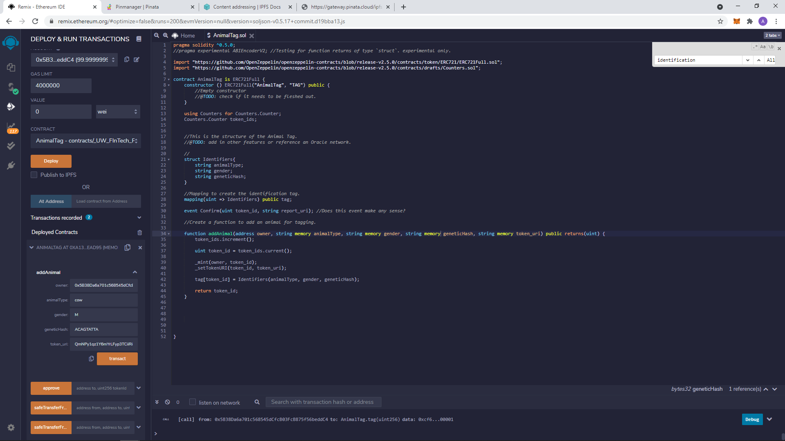

# AnimalTag 

## Project Description 

This is decentralized app (dApp) to digitially "tag" animals. Instead of using physical brandings or tags, the end-user (e.g. a farmer or rancher) can take a photo of their animals and 

## Objective 

The objective of this project is to create a decentralized application (dApp) that can be used to tag and track animals humanely. In contrast to physically tagging or branding animals, AnimalTag would allow end-users the abilitity to track their animals through photo and genetic record on the blockchain. Transfer of ownership is clear cut as 

## Technologies 
- [Solidity](https://docs.soliditylang.org/en/v0.8.4/)
- [Open Zeppelin](https://openzeppelin.com/contracts/)
- [Pinata](https://pinata.cloud/)
- [Chainlink](https://chain.link/)*         

## Running the Project 

1. Most of the programming can be done in the Remix IDE as it allows for virtual compilation and can be used with various EVM sandboxes. 

2. Contract is based around three primary functions: `addAnimal()`, `transferFrom()` and `removeAnimal()`. 

## Future Development 

3. *@TODO*: interface Solidity code with Python/Web3 or Node.js.

